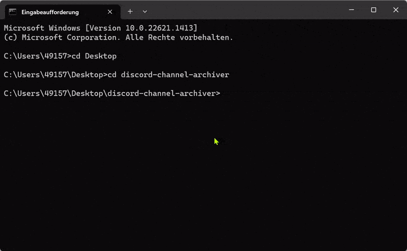

# discord-permissions-archive

A CLI tool that archives the permissions of discord channels. Mostly intended for speedrunning marathon discords. Maps all channel permissions into member-specific permissions, allowing you to clear out your roles while letting former talent look at old event channels.

## Installation & Usage

1. [Create a Discord bot application](https://discordjs.guide/preparations/setting-up-a-bot-application.html#your-bot-s-token) and obtain a token.
2. Ensure that the Server Members Intent is enabled.
3. Install [git](https://git-scm.com/downloads) and [nodejs](https://nodejs.org/en/))
4. Run the following commands in a terminal/command prompt:
```
git clone https://github.com/fgeorjje/discord-permissions-archive
cd discord-permissions-archive
npm install
node .
```
5. Follow the on-screen instructions.

## Demo



(Yes, I reset my token after I made the demo.)

## License

[MIT](LICENSE)